# Checklist IP & Code Review Security

Tài liệu chuẩn bị cho việc áp dụng BMad + SDD vào quy trình sản xuất phần mềm.
Phạm vi: dự án outsourcing, stack Golang / React-Vite-TypeScript / Ruby on Rails,
code được sinh một phần bằng AI agent.

Trạng thái: **review**

## 1. Năm cổng kiểm soát

Nhãn `G1`–`G5` được dùng lại ở phần checklist để chỉ nơi từng nhóm được chạy.

<figure class="diagram">
  
  <figcaption>Sơ đồ 1 — Vòng đời tổng quan. Mũi tên nét liền là luồng chính, nét đứt là việc chạy song song ngoài luồng PR.</figcaption>
</figure>

<figure class="diagram">
  
  <figcaption>Sơ đồ 2 — Phóng to cổng G3, gồm ba lớp. Không lớp nào thay thế được lớp sau: CI không thay được người, và AI review không có quyền approve.</figcaption>
</figure>

Hai điểm cần đọc ra từ sơ đồ. **Checklist IP nằm ở G1, không nằm ở G3** — đây là chỗ dễ
làm sai nhất, vì nếu để tới PR mới kiểm license thì thư viện đã được viết code quanh nó
rồi. **Vòng lặp G2 ↔ G3 là nơi tốn thời gian nhất**, nên kích cỡ story quyết định nó
chạy nhanh hay tắc, và đó là việc của SM ở bước chia story chứ không phải việc của
reviewer.

### G1 — Spec & Architecture (BMad Phase 1–3)

**Ai làm:** Analyst / PM / Architect / PO. **Tool:** không, đây là việc viết tài liệu.

Đây là cổng có đòn bẩy cao nhất và cũng hay bị bỏ qua nhất. Các quyết định sau nên được
ghi vào `architecture.md` và `tech-stack.md` để Dev agent luôn load được context:

- License allowlist và denylist (nội dung ở mục 4)
- Security standard theo từng stack (các item đặc thù Go / Vite / Rails ở mục 3)
- Yêu cầu audit log, mã hóa at rest, masking dữ liệu ở môi trường non-prod
- Quy tắc: mọi dependency mới đều phải được duyệt

**Checklist IP chạy ở phase này**, không phải ở PR, vì quyết định license là quyết định
kiến trúc; phát hiện ở PR thì đã muộn.

### G2 — Khi dev viết hoặc sinh code (local, pre-commit)

**Ai làm:** Dev. **Tool:** `gitleaks`, linter, type check.

- `gitleaks` ở pre-commit hook, chặn secret trước khi vào git history — xóa commit sau đó không đủ, phải rotate key
- Lint, format, `golangci-lint` (hoặc `go vet`), ESLint, Prettier, `tsc --noEmit`, RuboCop
- Dev đọc lại toàn bộ diff của agent trước khi mở PR

### G3 — Mỗi Pull Request (cổng nặng nhất)

**Ai làm:** CI tự động, sau đó AI review lớp 1 và con người lớp 2. Luồng ba lớp của cổng
này được vẽ ở sơ đồ 2 đầu mục 1.

Phần tự động, bắt buộc xanh mới merge được:

| Kiểm gì | Tool | Áp cho |
| --- | --- | --- |
| CVE + secret + license mức package | **Trivy** | cả 3 stack, một lệnh |
| Lỗ hổng đã biết của Go | `govulncheck` | Golang |
| SAST và lint | `golangci-lint` (`staticcheck`, `gosec`, `go vet`) | Golang |
| Lint, type check, SAST | ESLint, Prettier, `tsc --noEmit`, `eslint-plugin-security`, Semgrep OSS | React / Vite / TS |
| Lint, SAST | RuboCop, `rubocop-security`, Brakeman (xem lưu ý license ở mục 5) | Rails |
| CVE của gem | `bundler-audit` | Rails |
| Secret | `gitleaks` | cả 3 |
| Dấu vết code sao chép | script grep `Copyright`, `SPDX-License-Identifier`, `GPL`, `Licensed under` trong diff | cả 3 |
| Secret lọt vào bundle | grep tên biến `VITE_*` chứa `KEY` / `SECRET` / `TOKEN` / `PASSWORD` | React / Vite |
| Test và coverage không giảm | test runner sẵn có | cả 3 |

Sau khi CI xanh, con người chạy checklist ở mục 3.

### G4 — Nightly

**Ai làm:** CI theo schedule. **Tool:** Trivy image scan, Trivy config cho IaC.

Dành cho những việc chậm, không nên đặt ở PR: quét container image, quét IaC,
quét full dependency tree.

### G5 — Mỗi release

**Ai làm:** techlead + PM. **Tool:** **ScanCode\.io**, hoặc chỉ Trivy nếu chỉ cần SBOM.

- Sinh **SBOM** định dạng CycloneDX hoặc SPDX — Trivy làm được bằng `trivy fs --format cyclonedx`
- Sinh **file NOTICE / THIRD-PARTY-LICENSES** — đây mới là chỗ thực sự cần ScanCode\.io, bằng `scanpipe output --format attribution`
- Đóng gói hồ sơ: SBOM, báo cáo scan, registry các exception đã duyệt kèm lý do, người duyệt, ngày hết hạn
- Lưu trữ theo thời hạn hợp đồng, thường là 3 đến 7 năm

Đề xuất: SBOM và NOTICE nên là **hạng mục release trong SOW**, không phải tài liệu nội bộ.

## 2. Checklist 1 — Intellectual Property

### 2.1 Quyền và hợp đồng (G1)

- [ ] MSA / SOW có điều khoản nào về AI coding assistant? Cấm, hay yêu cầu khai báo?
- [ ] Nếu cần chấp thuận: đã có văn bản khách đồng ý, kèm danh sách tool cụ thể
- [ ] Ai sở hữu work product — được ghi thành câu trong SOW, không để mặc định
- [ ] Legal xác nhận: ở một số nước, tác phẩm do AI sinh thuần túy có thể không được bảo hộ bản quyền
- [ ] Nhân sự, kể cả intern và freelancer, đã ký IP assignment và AI usage policy
- [ ] Có allowlist các tool AI được duyệt; muốn thêm tool phải xin duyệt

### 2.2 Chống rò rỉ IP và dữ liệu qua model (G1 thiết lập, G2 tuân thủ hằng ngày)

- [ ] Cursor bật Privacy Mode / zero data retention, có bằng chứng bằng văn bản
- [ ] Legal đã review terms và DPA của model provider; kiểm tra data residency nếu khách yêu cầu
- [ ] `.cursorignore` loại trừ secret, config production, dữ liệu khách khỏi phạm vi index
- [ ] **Không đưa dữ liệu thật vào prompt.** Nếu là PHI, việc gửi cho model provider có thể cần chính provider nằm trong phạm vi BAA — điều mà terms tiêu chuẩn không đáp ứng. Đây là ranh giới pháp lý cứng, không phải best practice
- [ ] Tách workspace theo từng khách; code của khách A không xuất hiện trong context khi làm cho khách B

### 2.3 Provenance của code do AI sinh ra (G3)

- [ ] Grep diff tìm dấu hiệu code sao chép: `Copyright`, `SPDX-License-Identifier`, `Licensed under`, `GPL`, `@license`
- [ ] Khối code liền mạch từ khoảng 20–50 dòng trở lên trùng khớp một project OSS thì phải điều tra: viết lại, tuân thủ license, hoặc xin exception
- [ ] Cấm copy trực tiếp từ Stack Overflow — nội dung ở đó là CC BY-SA, tức có nghĩa vụ ghi công và share-alike, xung đột với sản phẩm closed-source
- [ ] Mỗi commit có một con người chịu trách nhiệm (`Reviewed-by`); không merge commit do bot tạo mà chưa ai duyệt
- [ ] Lưu vết truy xuất story ID → spec / prompt → file, tận dụng `Dev Agent Record` và `File List` của BMad

### 2.4 License của dependency (G1 policy, G3 thi hành)

- [ ] Có license policy ở dạng máy đọc được (nội dung ở mục 4)
- [ ] Scan cả transitive dependency, không chỉ direct — phần lớn rủi ro nằm ở tầng sâu
- [ ] **Chống hallucinated và typosquat package.** Agent thường đề xuất thư viện không tồn tại hoặc tên gần giống thư viện thật, và kẻ tấn công đã đăng ký sẵn những tên đó. Mỗi dependency mới phải kiểm repo gốc, số download, ngày publish đầu tiên, maintainer
- [ ] Lockfile được commit; CI cài bằng `--frozen-lockfile` hoặc `bundle install --deployment`
- [ ] Cảnh giác các package thương mại mà agent hay tự cài: **AG Grid Enterprise, Highcharts, FullCalendar Premium, FontAwesome Pro, Syncfusion**. Chúng cài được không cần key nhưng dùng trong sản phẩm thương mại là vi phạm license

### 2.5 Asset không phải code (G5)

- [ ] Font, icon, ảnh, video, âm thanh có license cho mục đích thương mại. Ví dụ cụ thể: **Calibri là font độc quyền của Microsoft, không được embed vào sản phẩm phân phối**; dùng Carlito nếu cần metric tương đương
- [ ] Dataset dùng để test hoặc train có license phù hợp
- [ ] Nội dung do AI sinh (text, hình ảnh) cũng có rủi ro trùng tác phẩm có bản quyền
- [ ] Trademark: tên sản phẩm và module không trùng nhãn hiệu đã đăng ký

### 2.6 Bằng chứng và lưu trữ (G5)

- [ ] Mỗi release lưu đủ bộ: SBOM, báo cáo license scan, báo cáo security scan, registry exception đã duyệt
- [ ] Thời hạn lưu tối thiểu bằng thời hạn hợp đồng — đây là hồ sơ khách đòi khi audit
- [ ] Có playbook xử lý khi phát hiện vi phạm: ai quyết định, trong bao lâu, có phải thông báo khách không

<!-- pagebreak -->

## 3. Checklist 2 — Code Review và Security

### 3.1 Review AI output

- [ ] PR khoảng dưới 400 dòng
- [ ] Reviewer hiểu code mới approve. Không giải thích được thì không merge, dù test đã xanh
- [ ] AI review là lớp 1, con người là lớp 2. Không để AI approve AI
- [ ] **Review diff của file test kỹ hơn cả code.** Kiểm tra có assertion nào bị gỡ, có `skip` mới, có mock hết khiến test vô nghĩa. Agent hay sửa test cho pass thay vì sửa bug
- [ ] Không còn TODO, placeholder, `not implemented`, dữ liệu fake hard-code
- [ ] Không viết lại util đã tồn tại — agent hay viết mới thay vì tìm

### 3.2 Truy xuất theo spec, đặc thù SDD (G3)

- [ ] PR link tới story hoặc spec ID
- [ ] Mọi Acceptance Criteria có test tương ứng, và mọi test map được về một AC
- [ ] Không có chức năng nào ngoài spec — scope creep do agent tự "làm thêm cho đủ"
- [ ] Nếu implementation lệch khỏi `architecture.md` thì phải cập nhật doc hoặc có ADR
- [ ] `File List` trong story khớp với diff thực tế

### 3.3 Security chung (G3)

Sắp theo tần suất mắc lỗi của code do AI sinh, không theo thứ tự OWASP.

- [ ] **Authorization và IDOR** — lỗi số một. Agent thường chỉ kiểm tra đã đăng nhập chưa mà quên kiểm tra user có quyền trên chính object đó không
- [ ] **Injection** — không nội suy chuỗi vào query; mọi raw query phải được review riêng
- [ ] **Input validation** — allowlist, strong params, không mass-assignment
- [ ] **Secret** không hard-code; nếu đã lộ thì phải rotate
- [ ] **XSS** — `html_safe` và `dangerouslySetInnerHTML` phải có lý do được viết ra
- [ ] **Crypto** — bcrypt hoặc argon2 cho password, không tự viết crypto, **không tắt TLS verification**
- [ ] **Cấu hình bị nới lỏng để cho chạy được**: CORS `*` kèm credentials, `--no-sandbox`, debug mode, chmod 777, container chạy root. Đây là pattern rất đặc trưng của code AI sinh
- [ ] SSRF (URL do user nhập phải qua allowlist), file upload (type, size, path traversal), deserialization
- [ ] CSRF token; cookie có `HttpOnly`, `Secure`, `SameSite`
- [ ] Rate limiting cho endpoint auth và endpoint tốn tài nguyên
- [ ] Security headers: CSP, HSTS, X-Content-Type-Options
- [ ] Log không chứa PII / PHI / token; có audit log cho hành động nhạy cảm
- [ ] Nếu sản phẩm có tính năng AI thì thêm OWASP LLM Top 10: prompt injection, insecure output handling, rò rỉ dữ liệu qua model
- [ ] Bảo vệ chính pipeline: agent không có credential production, không được tự merge (chống indirect prompt injection qua issue comment hoặc nội dung web)

### 3.4 Đặc thù Golang (G3)

Phần tự động chạy qua CI: `go vet`, `golangci-lint`, `govulncheck`, `gosec`. Phần dưới là
checklist người review sau khi CI xanh.

#### 3.4.1 Style guide

- [ ] Tuân thủ [Effective Go](https://go.dev/doc/effective_go)

#### 3.4.2 Phân tích code / lint

- [ ] `go vet` pass, không lỗi
- [ ] `golangci-lint` pass — gom `staticcheck`, `gosec` và nhiều linter khác trong một lệnh CI
- [ ] Error được xử lý đúng, không bỏ qua bằng `_` ở chỗ ghi dữ liệu — agent hay làm
- [ ] Method receiver type (`*T` vs `T`) hợp lý
- [ ] Value vs pointer dùng đúng chỗ
- [ ] Interface đặt ở package phù hợp — thường là phía consumer, không phải implementer
- [ ] Doc comment cho exported symbol có ý nghĩa
- [ ] Package comment có ý nghĩa
- [ ] `context.Context` truyền đúng; có timeout ở mọi lời gọi ra ngoài: DB, HTTP, Elasticsearch
- [ ] Unit test fail với message có ý nghĩa, không chỉ `t.Fatal(err)`

#### 3.4.3 Performance

- [ ] Goroutine và channel dùng đúng, không leak
- [ ] Parallelism an toàn — race condition, mutex, channel buffering
- [ ] Tránh gọi hàm không cần thiết trong hot path
- [ ] Value vs pointer tối ưu cho performance, không pointer hóa mọi thứ

#### 3.4.4 Security

- [ ] Không commit secret, key, credential — `gitleaks` ở G2/G3 là lớp tự động
- [ ] Input validation đầy đủ
- [ ] Không có lỗ hổng rõ ràng mà `gosec` / `govulncheck` đã báo nhưng bị bỏ qua
- [ ] **`math/rand` dùng để sinh token, ID hoặc password** — phải là `crypto/rand`. Agent mắc lỗi này rất thường xuyên
- [ ] `defer resp.Body.Close()` không bị thiếu
- [ ] Ép kiểu số có khả năng overflow ở chỗ tính số lượng hoặc giá

#### 3.4.5 Testing

- [ ] Unit test được thêm hoặc cập nhật theo thay đổi
- [ ] Tất cả test pass
- [ ] Edge case được cover — agent hay chỉ viết happy path

#### 3.4.6 Dependency và license

- [ ] `go.sum` được commit, không tắt checksum verification
- [ ] **Go link tĩnh nên LGPL trong Go tương đương GPL** — phải chặn thẳng, không để ở nhóm cần review

### 3.5 Đặc thù React + Vite + TypeScript (G3)

Phần tự động chạy qua CI: ESLint, Prettier, `tsc --noEmit`, `eslint-plugin-security`, Semgrep
OSS. Phần dưới là checklist người review sau khi CI xanh.

#### 3.5.1 Style guide

- [ ] Code tuân thủ quy ước TypeScript và formatting của dự án
- [ ] ESLint và Prettier pass, không bypass rule bằng `eslint-disable` trừ khi có lý do ghi rõ
- [ ] `strict: true` trong `tsconfig`; cấm `any` và `@ts-ignore` trong code mới — agent dùng chúng
  để cho compile được, và việc đó xóa mất chính lớp bảo vệ mà TypeScript mang lại

#### 3.5.2 Phân tích code / lint

- [ ] Tên biến, hàm, component rõ nghĩa
- [ ] Hàm và component nhỏ, modular, dễ bảo trì
- [ ] Hooks dùng đúng — `useEffect` có cleanup và dependency array chính xác; không mô phỏng
  lifecycle class component bằng cách hack `useEffect`
- [ ] Mỗi component một trách nhiệm (Single Responsibility)
- [ ] Props có `interface` hoặc `type` rõ ràng; validate logic trong render khi cần, không dựa vào
  runtime guess
- [ ] State management — nếu dùng Redux, Zustand hoặc TanStack Query — actions, reducer và query
  key implement đúng pattern của thư viện
- [ ] CSS qua CSS Modules, Tailwind hoặc styled-components; tránh inline style và `!important` rải rác
- [ ] Tương thích trình duyệt mục tiêu đã được xem xét
- [ ] Import thư viện đúng — tree-shaking friendly, không import cả package khi chỉ cần một hàm
- [ ] Code tổ chức rõ, format nhất quán

#### 3.5.3 Performance

- [ ] `React.memo`, `useMemo`, `useCallback` dùng khi cần giảm re-render — không lạm dụng
- [ ] Lazy load route và component nặng (`React.lazy`, dynamic `import()`)
- [ ] Ảnh và payload API tối ưu — kích thước, format, pagination

#### 3.5.4 Security

- [ ] **Biến môi trường tiền tố `VITE_` được nhúng thẳng vào bundle gửi cho browser.** Không đặt
  secret ở đó; CI có script grep riêng (mục 5.5)
- [ ] **Source map không được ship lên production** (`build.sourcemap: false`) — vừa là lỗ hổng bảo
  mật vừa là rò rỉ IP, vì source map cho phép dựng lại gần như toàn bộ source code
- [ ] Input validation đầy đủ ở cả client và server
- [ ] `dangerouslySetInnerHTML` phải có DOMPurify hoặc lý do được viết ra
- [ ] Không có lỗ hổng rõ ràng mà `eslint-plugin-security` / Semgrep đã báo nhưng bị bỏ qua
- [ ] Không có quyết định phân quyền nào chỉ nằm ở frontend — ẩn nút không phải là authorization

#### 3.5.5 Testing

- [ ] Unit test và component test được thêm hoặc cập nhật theo thay đổi
- [ ] Tất cả test pass
- [ ] Edge case được cover — agent hay chỉ viết happy path

### 3.6 Đặc thù Ruby on Rails (G3)

Phần tự động chạy qua CI: RuboCop, `rubocop-security`, Brakeman, `bullet` (test). Phần dưới là
checklist người review sau khi CI xanh.

#### 3.6.1 Coding convention

- [ ] Tên file và thư mục viết thường: `foo.rb`, `foo_bar.rb`
- [ ] `snake_case` cho symbol, method và biến
- [ ] `CapitalCase` cho class và module
- [ ] Độ dài dòng tối đa 120 ký tự
- [ ] Thụt lề nhất quán bằng space; không có trailing space cuối dòng
- [ ] Không dùng `;` để kết thúc dòng
- [ ] Mỗi dòng một biểu thức — tránh `a = 1; b = 2`
- [ ] Có space quanh toán tử, dấu phẩy — tránh `sum=1+2` hoặc `a,b=1,2`
- [ ] Không space bên trong `()` hoặc `[]`; có space bên trong `{}` — tránh `some( arg )`, dùng `some(arg)`
- [ ] Để một dòng trống giữa các method và block
- [ ] RuboCop pass trước khi mở PR — chạy ở G2 pre-commit và G3 CI
- [ ] Tuân thủ [Ruby Style Guide](https://github.com/rubocop/ruby-style-guide)

#### 3.6.2 Backend

- [ ] Comment logic phức tạp hoặc case đặc biệt; không comment những thứ đã tự giải thích
- [ ] Code ngắn gọn, dễ đọc; hàm mới không quá 50 dòng — agent hay sinh hàm dài
- [ ] Log khi xử lý exception
- [ ] Xử lý trường hợp dữ liệu có thể `nil`
- [ ] Xóa hết debug code trước khi commit: `binding.pry`, `debugger`, `puts`, `pp`
- [ ] Tuân thủ DRY — không lặp khối code giống hệt
- [ ] Tối đa 5 nhánh `if/else` mỗi hàm
- [ ] Unit test cho feature mới hoặc feature sửa (nếu có thể)
- [ ] Module và service thiết kế để tái sử dụng
- [ ] Ưu tiên gem được cộng đồng dùng rộng, có maintainer active — chống typosquat (mục 2.4)
- [ ] Hàm trả nhiều hơn một giá trị thì dùng `Hash` có key rõ nghĩa
- [ ] Không hard-code cấu hình — đặt trong `.yml`, credentials hoặc database
- [ ] Migration an toàn, dùng `strong_migrations`; không lock bảng lớn

#### 3.6.3 Security

- [ ] Validate dữ liệu user ở server — không chỉ ở client
- [ ] Sanitize parameter, chống SQL injection — không `where("... #{params[:x]}")`
- [ ] Không hiển thị exception chi tiết cho end user
- [ ] Mọi thông tin password phải được mã hóa — bcrypt hoặc argon2
- [ ] Brakeman không có finding từ mức Normal trở lên trước khi merge
- [ ] **IDOR** — phải là `current_user.hospital.items.find(params[:id])`, không phải `Item.find(params[:id])`.
  Đọc từng query trong controller
- [ ] **Serializer không phơi quá nhiều cột.** `render json: @record` hoặc `as_json` không giới hạn
  field sẽ trả về toàn bộ column, kể cả field nhạy cảm thêm sau này
- [ ] Strong params đầy đủ, không mass-assignment
- [ ] Phân quyền tập trung bằng Pundit hoặc CanCanCan, không rải `if current_user.admin?` khắp controller
- [ ] **Query Elasticsearch cũng phải filter theo tenant hoặc bệnh viện** — scope thường chỉ được
  cài ở ActiveRecord nên chỗ này lọt rất thường xuyên

#### 3.6.4 Performance

- [ ] Dùng kiểu dữ liệu phù hợp với yêu cầu
- [ ] Xem xét tác động khi chạy với khối lượng dữ liệu production
- [ ] Dùng cache khi cần
- [ ] Không N+1 query — `bullet` ở môi trường test và cho fail CI; Rails cộng agent gần như luôn sinh N+1
- [ ] Dữ liệu nhạy cảm at rest đã được mã hóa khi yêu cầu kiến trúc

#### 3.6.5 Thread safeness

- [ ] Code an toàn khi chạy đa luồng — đặc biệt biến class, constant mutable, memoization
- [ ] Không gây deadlock — lock theo thứ tự nhất quán, tránh nested lock không cần thiết

#### 3.6.6 Tránh

- [ ] Không dùng magic number hoặc magic string — đặt constant có tên
- [ ] Không áp design pattern nếu chưa hiểu rõ
- [ ] Không để dead code hoặc debug code

### 3.7 Chính sách severity và SLA (G3)

| Mức | Xử lý |
| --- | --- |
| Critical / High | Chặn merge, sửa ngay |
| Medium | Sửa trong sprint hiện tại |
| Low | Đưa vào backlog có nhãn |
| Exception | Phải có người duyệt cụ thể, lý do, và ngày hết hạn; ghi vào registry và review lại định kỳ |

### 3.8 Bổ sung vào Definition of Done (G3)

Thêm vào `story-dod-checklist.md` của BMad:

- [ ] Tất cả gate CI xanh
- [ ] Có con người (không phải AI) approve
- [ ] Không phát sinh secret mới
- [ ] Dependency mới đã được duyệt license
- [ ] SBOM đã cập nhật
- [ ] Doc hoặc ADR đã cập nhật nếu lệch kiến trúc

## 4. License policy chốt được ngay

Dùng giả định nghiêm ngặt, tức coi như có phân phối.

| Nhóm | Danh sách |
| --- | --- |
| **Cho phép** | MIT, Apache-2.0, BSD-2-Clause, BSD-3-Clause, ISC, Zlib, Unlicense, MPL-2.0 |
| **Chặn** | GPL-2.0, GPL-3.0, AGPL-3.0, **LGPL mọi phiên bản**, SSPL, BUSL, CC BY-NC, CC BY-SA, và **unknown / no license** |
| **Review từng ca** | Các package thương mại (xem mục 2.4) |

Lý do LGPL bị chặn thẳng thay vì để ở nhóm cần review: Go link tĩnh dependency vào
binary, và Vite bundle toàn bộ dependency vào file JS gửi cho browser. Cả hai đều làm
mất cơ chế dynamic linking mà LGPL dựa vào để giới hạn phạm vi copyleft.

Bảng này không nên chỉ nằm trong tài liệu. Nó khai được thành file `policies.yml` của
ScanCode\.io, mỗi license một `compliance_alert` ở mức `error` cho nhóm chặn và `warning`
cho nhóm review, để policy được thi hành bằng máy ở G5.

Ghi chú về mô hình phân phối, để khi biết câu trả lời thì điều chỉnh policy:

- **Khách tự vận hành, mình giao artifact** (source, Docker image, installer, hoặc chỉ một file `docker-compose.yml` kèm image) — đây **là** distribution. GPL và LGPL kích hoạt đầy đủ
- **Mình hoặc khách host, người dùng truy cập qua web** — GPL phần lớn không kích hoạt, **nhưng AGPL-3.0 thì có**: chỉ cần cho người dùng truy cập qua network là đã phát sinh nghĩa vụ cung cấp source. SSPL còn nặng hơn

## 5. Các tool sử dụng

Ba nhóm dưới đây khác nhau về bản chất, đừng trộn lẫn khi lập kế hoạch. Nhóm 5.1 và 5.2
là **tool quét**, chỉ chạy trong CI hoặc máy dev, không đi vào sản phẩm. Nhóm 5.4 là
**thư viện của chính sản phẩm**, phải đưa vào `Gemfile` hoặc `package.json` và chịu
license policy ở mục 4. Nhóm 5.5 là **script tự viết** vì không có tool sẵn nào làm.

### 5.1 Tool dùng chung cho cả ba stack

| Tool | Nguồn mở / trả phí | Công dụng | Cổng |
| --- | --- | --- | --- |
| **Trivy** | Nguồn mở, Apache-2.0 | CVE, secret, license mức package, sinh SBOM, quét container image và IaC | G3, G4, G5 |
| **gitleaks** | Nguồn mở, MIT | Secret trong diff và trong git history | G2, G3 |
| **ScanCode\.io** | Nguồn mở, Apache-2.0 | License và copyright mức file, sinh SBOM và file NOTICE, có policy engine và web UI cho legal | G5 |
| **Dependabot** | Miễn phí trên GitHub | Tự tạo PR nâng version khi dependency có CVE | ngoài luồng PR |

Toàn bộ bộ tool trong tài liệu này là **0 đồng license**. Không có hạng mục trả phí nào,
kể cả Black Duck — đánh đổi của quyết định đó được ghi ở mục 5.8.

### 5.2 Tool theo từng stack

**Golang**

| Tool | Nguồn mở / trả phí | Công dụng | Cổng |
| --- | --- | --- | --- |
| `golangci-lint` | Nguồn mở, GPL-3.0 | Gom `staticcheck`, `gosec`, `go vet` và nhiều linter khác; chạy một lệnh trong CI | G2, G3 |
| `govulncheck` | Nguồn mở, BSD-3 | CVE, có phân tích call-graph nên chính xác hơn scan lockfile | G3 |
| `gosec` | Nguồn mở, Apache-2.0 | SAST, các lỗi bảo mật đặc thù Go; thường gọi qua `golangci-lint` | G3 |
| `staticcheck` | Nguồn mở, MIT | SAST và chất lượng code; thường gọi qua `golangci-lint` | G3 |
| `go vet` | Có sẵn trong toolchain | Kiểm tra tĩnh cơ bản | G2, G3 |
| `go-licenses` | Nguồn mở, Apache-2.0 | License của dependency Go, tùy chọn vì Trivy đã cover | G3 |

**React + Vite + TypeScript**

| Tool | Nguồn mở / trả phí | Công dụng | Cổng |
| --- | --- | --- | --- |
| ESLint + Prettier | Nguồn mở, MIT | Style, formatting và quy ước code; chạy ở pre-commit và CI | G2, G3 |
| Semgrep OSS | Nguồn mở, LGPL-2.1 | SAST, hỗ trợ luôn cả Go và Ruby nên có thể dùng chung | G3 |
| `eslint-plugin-security` | Nguồn mở, Apache-2.0 | SAST rule bảo mật trong ESLint | G2, G3 |
| `tsc --noEmit` | Có sẵn | Type check, chặn `any` và `@ts-ignore` lọt vào | G2, G3 |
| `npm audit` | Có sẵn | CVE, tùy chọn vì Trivy đọc cùng `package-lock.json` | G3 |

**Ruby on Rails**

| Tool | Nguồn mở / trả phí | Công dụng | Cổng |
| --- | --- | --- | --- |
| RuboCop | Nguồn mở, MIT | Coding convention và style; chạy ở pre-commit và CI | G2, G3 |
| Brakeman | Miễn phí non-commercial, xem 5.7 | SAST hiểu framework Rails, 86 check | G3 |
| `rubocop-security` | Nguồn mở, MIT | Rule bảo mật trong RuboCop | G3 |
| `bundler-audit` | Nguồn mở, GPL-3.0 | CVE của gem, tùy chọn vì Trivy đọc `Gemfile.lock` | G3 |
| `license_finder` | Nguồn mở, MIT | License của gem, tùy chọn vì Trivy đã cover | G3 |

### 5.3 Bộ tối thiểu để khởi động: sáu tool

Danh sách trên nhìn nhiều, nhưng **Trivy đọc được cả `go.sum`, `package-lock.json` và
`Gemfile.lock`** nên nó đã bao phủ phần lớn công việc của các tool khác. Nếu muốn chạy
được ngay trong tuần đầu, chỉ cần sáu cái:

1. **Trivy** — CVE, secret, license, SBOM, image, IaC cho cả ba stack trong một lệnh
2. **gitleaks** — đặt ở pre-commit, vì chờ tới CI thì secret đã vào git history
3. **govulncheck** — giữ riêng vì phân tích call-graph, chính xác hơn hẳn scan theo lockfile
4. **Semgrep OSS** — một tool cover SAST cho cả ba ngôn ngữ
5. **Brakeman** — giữ riêng cho Rails vì hiểu framework, thứ Semgrep không làm được ở cùng độ sâu
6. **ScanCode\.io** — chỉ dựng khi tới gần release và cần file NOTICE

Có thể bỏ hoặc để sau vì trùng với Trivy: `npm audit`, `bundler-audit`, `go-licenses`,
`license_finder`. Riêng **Dependabot** vẫn nên bật vì nó làm việc khác — tự tạo PR nâng
version chứ không chỉ báo lỗi. Nhóm `gosec`, `staticcheck` thường đã nằm trong
`golangci-lint`; chỉ chạy riêng khi cần debug một linter cụ thể. `rubocop-security` và
`eslint-plugin-security` là lớp bổ sung cho Rails và React, thêm sau khi bộ sáu đã chạy ổn.

### 5.4 Thư viện phải cài vào chính sản phẩm

Khác hẳn nhóm trên: đây là dependency của app, nên bản thân chúng cũng phải qua license
policy ở mục 4.

| Thư viện | Nguồn mở / trả phí | Công dụng | Stack |
| --- | --- | --- | --- |
| Pundit hoặc CanCanCan | Nguồn mở, MIT | Phân quyền tập trung, chống IDOR | Rails |
| `bullet` | Nguồn mở, MIT | Phát hiện N+1, chạy ở môi trường test và cho fail CI | Rails |
| `strong_migrations` | Nguồn mở, MIT | Chặn migration làm lock bảng lớn | Rails |
| DOMPurify | Nguồn mở, Apache-2.0 / MPL-2.0 | Sanitize khi buộc dùng `dangerouslySetInnerHTML` | React |
| bcrypt hoặc argon2 | Nguồn mở, MIT / Apache-2.0 | Hash password | Rails, Go |

Mục 3.4 còn yêu cầu dùng `crypto/rand` thay `math/rand` — cái này là stdlib của Go, không
phải thư viện phải cài.

### 5.5 Hai script phải tự viết

Không có tool sẵn nào làm hai việc này, và cả hai đều rẻ, khoảng vài chục dòng shell.

1. **Grep license header trong diff** — tìm `Copyright`, `SPDX-License-Identifier`, `GPL`, `Licensed under`, `@license`. Đây là biện pháp thay thế cho snippet matching mà bộ 0 đồng không làm được
2. **Grep secret trong biến `VITE_*`** — tìm tên biến chứa `KEY`, `SECRET`, `TOKEN`, `PASSWORD`. Cần riêng vì Vite nhúng thẳng các biến này vào bundle gửi cho browser, và không tool nào coi đó là lỗi

### 5.6 Ghi chú lựa chọn: Trivy và ScanCode

**Trivy** (Aqua Security, Apache-2.0) là scanner bảo mật all-in-one: một binary, không
cần server. Nó quét CVE trên dependency (đọc `go.sum`, `package-lock.json`, `Gemfile.lock`),
secret, misconfig IaC, container image, và license **ở mức package** — tức là tin vào
metadata mà package tự khai. Nó cũng sinh SBOM (CycloneDX / SPDX). Vì vậy Trivy phù hợp
làm gate CI trên mọi PR (G3) và quét image/IaC ban đêm (G4): đủ nhanh, cover cả ba stack
trong một lệnh. Điểm yếu: package khai `"license": "MIT"` vẫn có thể chứa thư mục `vendor/`
có code GPL bên trong, và Trivy không đọc nội dung file nên không thấy.

**ScanCode** (AboutCode) là bộ công cụ chuyên về **inventory giấy phép và copyright**.
Hai lớp hay gặp:

- **ScanCode Toolkit** — CLI quét nội dung từng file: license text, license header, dòng
  copyright, package metadata. Đây là lớp bắt được rủi ro của code AI sinh: file copy nguyên
  khối kéo theo header GPL/AGPL.
- **ScanCode\.io** — ứng dụng trên Toolkit (Docker + Postgres + web UI): pipeline, policy
  engine (`policies.yml`), xuất file NOTICE / attribution, SBOM file-level. Đây là thứ
  tài liệu này chọn cho cổng release (G5).

ScanCode chậm vì phải đọc và so khớp text từng file, không chỉ lockfile. Đừng đặt trên
mọi PR. Trivy đã sinh được SBOM bằng `trivy fs --format cyclonedx`, nên **chưa cần dựng
ScanCode\.io ngay** — chỉ dựng khi tới gần release và cần NOTICE + policy legal.

| Tiêu chí | Trivy | ScanCode (Toolkit / ScanCode\.io) |
| --- | --- | --- |
| Nhà phát triển | Aqua Security | AboutCode (nexB) |
| License tool | Apache-2.0 | Apache-2.0 (dataset license: CC-BY-4.0) |
| Việc chính | CVE, secret, IaC, image, license package, SBOM | License + copyright mức file, NOTICE, policy legal |
| Cách quét | Metadata / lockfile / image layer | Đọc nội dung từng file (text matching) |
| Độ sâu license | Nông — tin vào field `license` của package | Sâu — thấy header, LICENSE file, code copy kèm giấy phép |
| Đầu ra | Báo cáo CVE/secret, SBOM CycloneDX/SPDX | SBOM, file NOTICE, web UI, `compliance_alert` |
| Hạ tầng | Một binary, chạy trong CI | Toolkit: CLI Python. ScanCode\.io: Docker + Postgres |
| Cổng phù hợp | G3 (mọi PR), G4 (image/IaC) | G5 (gần release) |
| **Thời gian chạy** | **Giây đến khoảng 1 phút** cho repo app sau khi cache DB CVE. Lần đầu chậm hơn vì tải DB (~vài chục MB đến ~100 MB). Quét image thường **10–60 giây**. | **Phút đến giờ.** Repo nhỏ: vài phút. Repo vừa (vài nghìn file): **10–30+ phút**. Có `node_modules` / `vendor` / monorepo: **hàng giờ**. ScanCode\.io thêm overhead pipeline/DB. |

Quy tắc dùng: **Trivy trên mọi PR; ScanCode chỉ khi chuẩn bị release.** Hai tool không
thay thế nhau — một cái nhanh và rộng, một cái chậm và sâu về IP.

### 5.7 Lưu ý về license của chính các tool

**Nguyên tắc chung:** license của tool **không lây sang sản phẩm của khách**, miễn là chỉ
chạy nó như một chương trình riêng biệt trong CI, không link vào code và không phân phối
lại. Nên `bundler-audit` là GPL-3.0 hay Semgrep OSS là LGPL-2.1 đều hoàn toàn không tạo
nghĩa vụ gì cho release.

**Ngoại lệ đáng lưu ý là Brakeman.** Từ 15/6/2018, Brakeman không còn là MIT mà dùng
"Brakeman Public Use License" thuộc Synopsys, miễn phí cho non-commercial use, trong đó
liệt kê ví dụ về commercial use là "dùng software như một thành phần của dịch vụ hoặc sản
phẩm có giá trị gia tăng". Tác giả Justin Collins đã xác nhận công khai rằng quét code của
chính mình hoặc của công ty mình **không** tính là commercial use, kể cả khi code đó là
proprietary; mục đích thật của điều khoản là ngăn đối thủ dựng sản phẩm cạnh tranh trên
Brakeman.

Với công ty outsourcing quét code của khách như một phần dịch vụ có thu phí, trường hợp
này gần ranh giới hơn một team in-house, dù khả năng cao vẫn thuộc diện được phép. Hai
cách xử lý để không còn chỗ nào để hỏi: email tác giả xin xác nhận bằng văn bản (license
ghi rõ họ có thể cấp commercial license miễn phí), hoặc dùng Semgrep ruleset cho Rails.

### 5.8 Khoảng trống đã biết, đừng hứa là đã đóng

Bộ tool 0 đồng **không** phát hiện được code AI sinh trùng với project copyleft ở mức
snippet. ScanCode giỏi phát hiện license trong file, nhưng snippet matching cần dựng thêm
PurlDB / MatchCode và độ phủ vẫn kém xa các cơ sở dữ liệu thương mại. Đây là khoảng trống
**đã chấp nhận có ý thức**, đánh đổi để không phát sinh chi phí license.

Cách bù lại là **chuyển từ phát hiện sang phòng ngừa**, gồm bốn biện pháp đã nằm rải rác
trong tài liệu, đều miễn phí:

1. **Grep license header trong diff ở G3** — mục 5.5. Phần lớn code AI copy nguyên khối đều kéo theo dấu vết nhận biết được, nên biện pháp thô này bắt được nhiều hơn kỳ vọng
2. **Buộc PR nhỏ** — mục 3.1. Diff lớn là nơi code sao chép lọt qua dễ nhất vì không ai đọc hết
3. **Cấm copy-paste, và không hiểu thì không merge** — mục 3.1. Người approve chịu trách nhiệm về code, kể cả phần agent sinh
4. **Chốt license allowlist ở G1 chứ không ở G3** — mục 4. Ngăn thư viện xấu vào từ đầu rẻ hơn nhiều so với gỡ nó ra sau khi đã viết code quanh nó

**Điều quan trọng là đừng cam kết quá trong hợp đồng.** Nếu khách yêu cầu bảo đảm tuyệt
đối về IP ở mức snippet, đó là phạm vi mà quy trình hiện tại không phủ được, và cần được
xử lý ở bàn đàm phán SOW — hoặc giới hạn cam kết, hoặc coi audit là hạng mục riêng do
khách chi trả — chứ không nên hứa rồi dựa vào một bộ tool không có năng lực đó.

### 5.9 Bốn thứ chưa chốt, cần quyết trước khi triển khai

Chi tiết hạ tầng cần dựng nằm ở **mục 6**. Bốn điểm dưới đây là phần chưa quyết:

1. **Tool AI review ở lớp 1 chưa được nêu tên.** Sơ đồ 2 và mục 3.1 chỉ ghi "AI review là lớp 1". Cần chọn một cái cụ thể — Bugbot, CodeRabbit, hoặc Copilot code review — và thống nhất rằng nó không có quyền approve
2. **Nền tảng CI chưa xác định** — GitHub Actions, GitLab CI hay Jenkins
3. **Framework pre-commit chưa chọn** — husky, lefthook hay `pre-commit`
4. **Chưa có DAST** — nên bổ sung OWASP ZAP trên staging, mỗi sprint một lần

<!-- pagebreak -->

## 6. Hạ tầng cần dựng

Mục này liệt kê những gì **không đi vào sản phẩm** (khác mục 5.4), mà phải cài trên máy dev,
CI, hoặc server riêng. Config file (`.golangci.yml`, `.eslintrc`, workflow YAML) nằm trong
repo, nhưng bản thân tool và nền tảng chạy nó thì nằm ngoài source code ứng dụng.

### 6.1 Nền tảng bắt buộc

| Thành phần | Cổng | Việc làm | Trạng thái |
| --- | --- | --- | --- |
| **Nền tảng CI** | G3, G4, G5 | Chạy pipeline mỗi PR, nightly, release | Chưa chốt — mục 5.9 |
| **Pre-commit hook** | G2 | Chặn secret và lỗi lint trước khi vào git history | Chưa chốt — mục 5.9 |
| **Branch protection** | G3 | Bắt buộc CI xanh và người approve mới merge | Cấu hình trên GitHub/GitLab |
| **ScanCode\.io** | G5 | NOTICE, SBOM sâu, policy engine | Chỉ dựng gần release đầu |

### 6.2 Tool theo cổng

**G2 — máy dev, pre-commit**

| Tool | Stack |
| --- | --- |
| `gitleaks` | Cả 3 |
| `golangci-lint` | Go |
| ESLint, Prettier, `tsc --noEmit` | React / Vite / TS |
| RuboCop | Rails |

**G3 — CI, mỗi PR**

| Tool | Stack |
| --- | --- |
| **Trivy** | Cả 3 — CVE, secret, license package |
| `gitleaks` | Cả 3 |
| `govulncheck` | Go |
| `golangci-lint` | Go |
| ESLint, Prettier, `tsc --noEmit`, `eslint-plugin-security` | React / Vite / TS |
| Semgrep OSS | Cả 3 — SAST chung |
| RuboCop, `rubocop-security`, Brakeman | Rails |
| 2 script grep (mục 5.5) | Cả 3 |
| Test runner (`go test`, Vitest/Jest, RSpec) | Từng stack |

**G4 — CI nightly**

| Tool | Việc làm |
| --- | --- |
| **Trivy** | Quét container image và IaC |

**G5 — release**

| Tool | Việc làm |
| --- | --- |
| **ScanCode\.io** | NOTICE, SBOM file-level, policy — hoặc chỉ Trivy nếu chỉ cần SBOM |
| **Trivy** | `trivy fs --format cyclonedx` khi chưa có ScanCode |

### 6.3 Dịch vụ platform (không cài binary)

| Dịch vụ | Cổng | Ghi chú |
| --- | --- | --- |
| **Dependabot** | Ngoài luồng PR | Cần GitHub; tự tạo PR nâng version khi có CVE |
| **AI review** (Bugbot / CodeRabbit / Copilot) | G3 lớp 1 | Chưa chốt — mục 5.9 |
| **OWASP ZAP** | Staging | DAST; chưa có — mục 5.9 |
| **Cursor** (Privacy Mode) | G2 | Cấu hình IDE, không phải CI |

### 6.4 Bộ tối thiểu tuần đầu

Nếu muốn chạy được ngay, dựng theo thứ tự:

1. CI platform + branch protection
2. Pre-commit: `gitleaks` + linter từng stack
3. **Trivy** trên mọi PR
4. **`govulncheck`** + **`golangci-lint`** cho Go
5. **ESLint + Prettier + `tsc`** cho React
6. **RuboCop + Brakeman** cho Rails
7. **Semgrep OSS** — SAST chung một lệnh
8. Hai script grep (mục 5.5)
9. Bật **Dependabot** nếu dùng GitHub
10. **ScanCode\.io** — để sau, gần release đầu

### 6.5 Không cần dựng riêng

| Tool | Lý do |
| --- | --- |
| `npm audit`, `bundler-audit`, `go-licenses`, `license_finder` | Trivy đã đọc lockfile |
| `gosec`, `staticcheck`, `go vet` riêng lẻ | Đã nằm trong `golangci-lint` |
| ORT, Black Duck | Đã loại khỏi tài liệu |

### 6.6 Tóm tắt: dựng ở đâu

```
Máy dev (G2)      → gitleaks, golangci-lint, ESLint, Prettier, RuboCop, tsc
CI mỗi PR (G3)    → Trivy, govulncheck, Semgrep, Brakeman, golangci-lint,
                    ESLint, RuboCop, gitleaks, 2 script grep, test runner
CI ban đêm (G4)   → Trivy image + IaC
Server riêng (G5) → ScanCode.io (hoặc Trivy CLI cho SBOM)
GitHub (ngoài)    → Dependabot, branch protection, AI review
```

<!-- pagebreak -->

## 7. Bảng thuật ngữ viết tắt

Chỉ gồm các từ có xuất hiện trong tài liệu này. Sắp theo nhóm chủ đề, trong mỗi nhóm
theo thứ tự chữ cái.

### 7.1 Quy trình và vai trò

| Viết tắt | Tên đầy đủ | Nghĩa trong tài liệu này |
| --- | --- | --- |
| AC | Acceptance Criteria | Tiêu chí chấp nhận của story; mỗi AC phải có test tương ứng |
| ADR | Architecture Decision Record | Văn bản ghi lại một quyết định kiến trúc và lý do |
| BMad | Breakthrough Method of Agile AI-Driven Development | Framework agile dùng agent AI, chia theo phase và checklist |
| CI | Continuous Integration | Hệ thống chạy build và test tự động, ở đây là cổng G3 và G4 |
| DoD | Definition of Done | Điều kiện coi một story là xong, mục 3.8 |
| G1–G5 | Gate 1 đến Gate 5 | Năm cổng kiểm soát ở mục 1 |
| PM | Product Manager | Cùng techlead chịu trách nhiệm hồ sơ release ở G5 |
| PO | Product Owner | Duyệt spec và story ở cổng G1 |
| PR | Pull Request | Nhánh code đề nghị merge, đơn vị được review ở G3 |
| SDD | Spec-Driven Development | Lấy spec làm nguồn chân lý để agent sinh code |
| SLA | Service Level Agreement | Ở đây là thời hạn phải sửa theo mức severity, mục 3.7 |
| SM | Scrum Master | Người chia story, quyết định kích cỡ PR |

### 7.2 Hợp đồng và pháp lý

| Viết tắt | Tên đầy đủ | Nghĩa trong tài liệu này |
| --- | --- | --- |
| BAA | Business Associate Agreement | Hợp đồng theo HIPAA, bắt buộc khi bên thứ ba xử lý PHI |
| DPA | Data Processing Agreement | Hợp đồng xử lý dữ liệu với model provider |
| IP | Intellectual Property | Quyền sở hữu trí tuệ, chủ đề của checklist 1 |
| MSA | Master Service Agreement | Hợp đồng khung với khách |
| PHI | Protected Health Information | Dữ liệu sức khỏe được pháp luật bảo vệ |
| PII | Personally Identifiable Information | Dữ liệu định danh cá nhân |
| SOW | Statement of Work | Phụ lục mô tả phạm vi, nơi ghi ai sở hữu work product |

### 7.3 Bảo mật

| Viết tắt | Tên đầy đủ | Nghĩa trong tài liệu này |
| --- | --- | --- |
| CORS | Cross-Origin Resource Sharing | Cấu hình `*` kèm credentials là lỗi hay gặp ở code AI sinh |
| CSP | Content Security Policy | Security header chống XSS |
| CSRF | Cross-Site Request Forgery | Buộc user đã đăng nhập thực hiện hành động ngoài ý muốn |
| CVE | Common Vulnerabilities and Exposures | Mã định danh một lỗ hổng đã được công bố |
| DAST | Dynamic Application Security Testing | Quét động trên app đang chạy; hiện còn thiếu, mục 6.3 |
| HSTS | HTTP Strict Transport Security | Security header buộc dùng HTTPS |
| IaC | Infrastructure as Code | Cấu hình hạ tầng dạng file, quét ở G4 |
| IDOR | Insecure Direct Object Reference | Truy cập object của người khác qua ID; lỗi số một của code AI sinh |
| LLM | Large Language Model | Mô hình ngôn ngữ lớn |
| N+1 | — | Vòng lặp sinh một query mỗi phần tử thay vì một query gộp |
| OWASP | Open Worldwide Application Security Project | Tổ chức phi lợi nhuận về bảo mật ứng dụng, nguồn của Top 10 |
| SAST | Static Application Security Testing | Quét lỗ hổng trong source code, không cần chạy app |
| SCA | Software Composition Analysis | Quét lỗ hổng và license của dependency, khác SAST |
| SSRF | Server-Side Request Forgery | Bắt server gọi tới URL do kẻ tấn công chỉ định |
| TLS | Transport Layer Security | Mã hóa đường truyền; tuyệt đối không tắt verification |
| XSS | Cross-Site Scripting | Chèn script vào trang để chạy trên browser người khác |

### 7.4 License và hồ sơ tuân thủ

| Viết tắt | Tên đầy đủ | Nghĩa trong tài liệu này |
| --- | --- | --- |
| copyleft | — | Điều khoản buộc bản phái sinh cùng license; gốc của rủi ro GPL |
| CycloneDX | — | Một định dạng SBOM; Trivy và ScanCode\.io đều xuất được |
| NOTICE | — | File liệt kê license bên thứ ba; nghĩa vụ của MIT, Apache-2.0, BSD |
| OSS | Open Source Software | Phần mềm nguồn mở |
| SBOM | Software Bill of Materials | Danh mục toàn bộ thành phần trong một bản build |
| SPDX | Software Package Data Exchange | Chuẩn định danh license, và một định dạng SBOM |

### 7.5 Các license nhắc ở mục 4

| Viết tắt | Tên đầy đủ | Nhóm |
| --- | --- | --- |
| AGPL | Affero General Public License | Chặn; kích hoạt cả khi chỉ cho truy cập qua network |
| Apache-2.0 | Apache License 2.0 | Cho phép |
| BSD | Berkeley Software Distribution License | Cho phép, bản 2-Clause và 3-Clause |
| BUSL | Business Source License | Chặn; chỉ thành nguồn mở sau một thời hạn |
| CC BY-NC | Creative Commons Attribution-NonCommercial | Chặn; cấm dùng thương mại |
| CC BY-SA | Creative Commons Attribution-ShareAlike | Chặn; có share-alike, là license của Stack Overflow |
| GPL | GNU General Public License | Chặn |
| ISC | Internet Systems Consortium License | Cho phép |
| LGPL | Lesser General Public License | Chặn; Go link tĩnh và Vite bundle làm mất dynamic linking |
| MIT | MIT License | Cho phép |
| MPL-2.0 | Mozilla Public License 2.0 | Cho phép; copyleft giới hạn trong từng file |
| SSPL | Server Side Public License | Chặn; nặng hơn cả AGPL |

### 7.6 Kỹ thuật khác

| Viết tắt | Tên đầy đủ | Nghĩa trong tài liệu này |
| --- | --- | --- |
| JVM | Java Virtual Machine | Môi trường chạy của ORT, một lý do loại ORT |
| ORT | OSS Review Toolkit | Tool đã bị loại, mục 5.6 |
| stdlib | Standard library | Thư viện chuẩn có sẵn của ngôn ngữ |
| UI | User Interface | Ở đây là web UI của ScanCode\.io cho legal tự xem |
